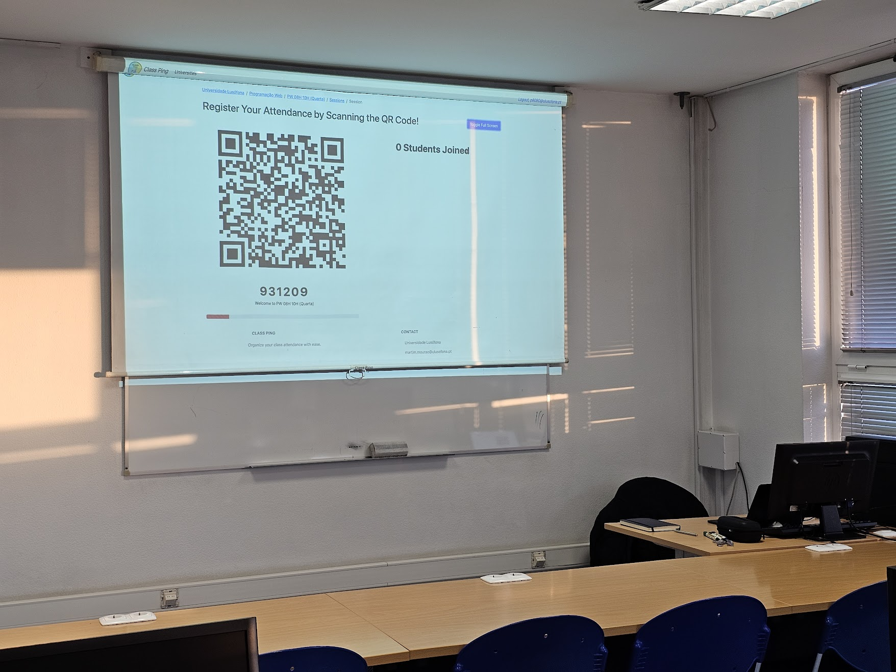
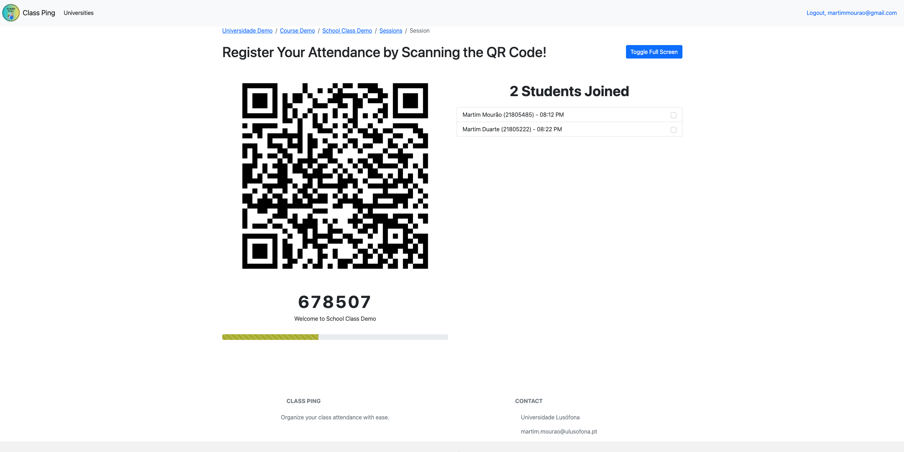
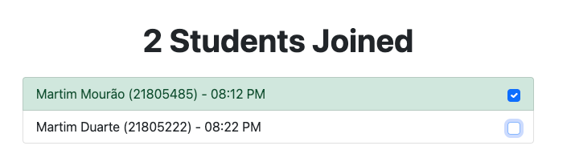
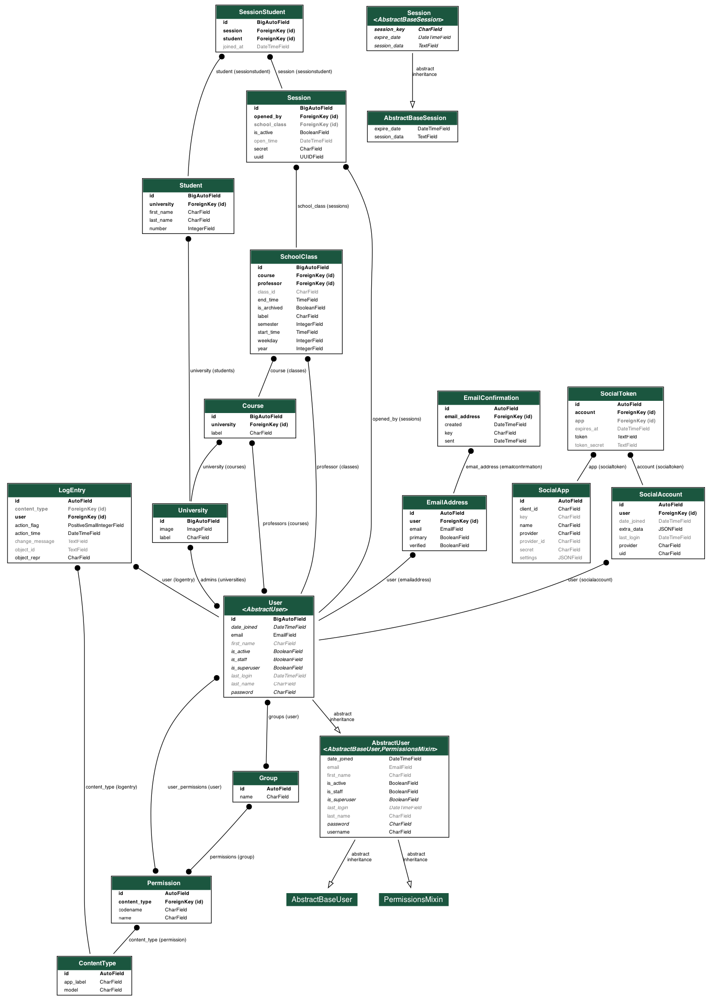

## Stack

- **Django**
- **NinjaAPI** 
- **Bootstrap** 

## How It Works

- **OTP Display System:** The professor projects a dynamic OTP code that automatically refreshes at regular intervals, ensuring secure attendance verification during class sessions.

    

- **Student Confirmation:** Students mark their attendance by entering the OTP shown, which verifies their presence.

    

- **Double Confirmation System:** The professor can use a checkbox system to manually call out each student and confirm their attendance in the class.

    

## DB Schema

    

## Contact

For questions, please contact:
- Email: aksuryawanshi2006@gmail.com
